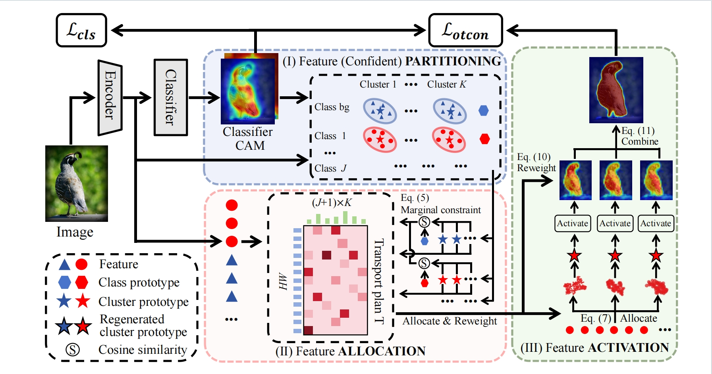

# POT: Prototypical Optimal Transport for Weakly Supervised Semantic Segmentation

The implementation of POT: Prototypical Optimal Transport for Weakly Supervised Semantic Segmentation,  CVPR 2025.

### Abstract

Weakly Supervised Semantic Segmentation (WSSS) leverages Class Activation Maps (CAMs) to extract spatial information from image-level labels. However, CAMs primarily highlight the most discriminative foreground regions, leading to incomplete results. Prototype-based methods attempt to address this limitation by employing prototype CAMs instead of classifier CAMs. Nevertheless, existing prototype-based methods typically use a single prototype for each class, which is insufficient to capture all attributes of the foreground features due to the significant intra-class variations across different images. Consequently, these methods still struggle with incomplete CAM predictions. In this paper, we propose a novel framework called Prototypical Optimal Transport (POT) for WSSS. POT enhances CAM predictions by dividing features into multiple clusters and activating each cluster using its prototype. In this process, a similarity-aware optimal transport is employed to assign features to the most probable clusters. This similarity-aware strategy ensures the prioritization of significant cluster prototypes, thereby improving the accuracy of feature assignment. Additionally, we introduce an adaptive OT-based consistency loss to refine feature representations. This framework effectively overcomes the limitations of single-prototype methods, providing more complete and accurate CAM predictions. Extensive experimental results on standard WSSS benchmarks (PASCAL VOC and MS COCO) demonstrate that our method significantly improves the quality of CAMs and achieves state-of-the-art performances. The source code will be released https://github.com/jianwang91/POT.



### Environment

  * Python \>= 3.8
  * Pytorch \>= 1.8.0
  * Torchvision
  * scikit-image
  * numpy
  * opencv-python

### Usage

#### Step 1. Prepare Dataset

  Following the previous method, CLIP-ES to prepare the dataset and base CAM npy files, [CLIP-ES]:(https://github.com/linyq2117/CLIP-ES), or directly download the CAM npy files here:(uploading)

#### Step 2. Train POT

Execute the following script to start the training process. 

```bash
bash run_voc.sh
```
#### Step 3. Train Fully Supervised Segmentation Models


To train fully supervised segmentation models, we refer to [deeplab v2](https://github.com/Wu0409/HSC_WSSS),  and [seamv1](https://github.com/YudeWang/semantic-segmentation-codebase/tree/main/experiment/seamv1-pseudovoc).
```bash
bash test.sh
```

### Results


### Citation

If you find this work useful for your research, please consider citing our paper:

```bibtex
@inproceedings{wang2025pot,
  title={POT: Prototypical Optimal Transport for Weakly Supervised Semantic Segmentation},
  author={Wang, Jian and Dai, Tianhong and Zhang, Bingfeng and Yu, Siyue and Lim, Eng Gee and Xiao, Jimin},
  booktitle={Proceedings of the Computer Vision and Pattern Recognition Conference},
  pages={15055--15064},
  year={2025}
}
```
